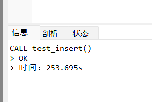
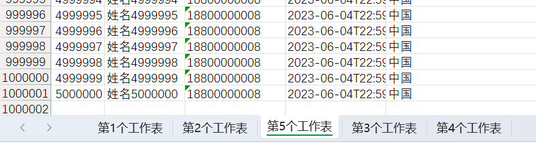

## 百万数据导出

### 概述

Excel可以分为早期的Excel2003版本（使用POI的HSSF对象操作）和Excel2007版本（使用POI的XSSF操作），两者对百万数据的支持如下：

* Excel 2003：在POI中使用HSSF对象时，excel 2003最多只允许存储65536条数据，一般用来处理较少的数据量。这时对于百万级别数据，Excel肯定容纳不了
* Excel 2007：当POI升级到XSSF对象时，它可以直接支持excel2007以上版本，因为它采用ooxml格式。这时excel可以支持1048576条数据，单个sheet表就支持近百万条数据。但实际运行时还可能存在问题，原因是执行POI报表所产生的行对象，单元格对象，字体对象，他们都不会销毁，这就导致OOM的风险


### 解决方案分析

对于百万数据量的Excel导入导出，只讨论基于Excel2007的解决方法。在ApachePoi 官方提供了对操作大数据量的导入导出的工具和解决办法，操作Excel2007使用XSSF对象，可以分为三种模式：

*  java代码解析xml
*  dom4j一次性加载xml文件再解析
*  SAX逐行加载，逐行解析


**用户模式：**用户模式有许多封装好的方法操作简单，但创建太多的对象，非常耗内存（之前使用的方法）

**事件模式：**基于SAX方式解析XML，SAX全称Simple API for XML，它是一个接口，也是一个软件包。它是一种XML解析的替代方法，不同于DOM解析XML文档时把所有内容一次性加载到内存中的方式，它逐行扫描文档，一边扫描，一边解析。

**SXSSF对象**：是用来生成海量excel数据文件，主要原理是借助临时存储空间生成excel


导出时使用的是SXSSFWorkBook这个类，一个工作表sheet最多只能放1048576行数据， 当我们的业务数据已超过100万了，一个sheet就不够用了，必须拆分到多个工作表。

导出百万数据时有两个弊端：

1. 不能使用模板

2. 不能使用太多的样式  


### 原理分析

在实例化SXSSFWorkBook这个对象时，可以指定在内存中所产生的POI导出相关对象的数量（默认100），一旦内存中的对象的个数达到这个指定值时，就将内存中的这些对象的内容写入到磁盘中（XML的文件格式），就可以将这些对象从内存中销毁，以后只要达到这个值，就会以类似的处理方式处理，直至Excel导出完成。


### 准备数据

sql表结构：

```sql
CREATE TABLE `user` (
  `id` bigint(20) NOT NULL  COMMENT '用户ID',
  `user_name` varchar(100) DEFAULT NULL COMMENT '姓名',
  `phone` varchar(15) DEFAULT NULL COMMENT '手机号',
  `hire_date` datetime DEFAULT NULL COMMENT '入职日期',
  `address` varchar(300) DEFAULT NULL COMMENT '现在住址' 
) ENGINE=InnoDB DEFAULT CHARSET=utf8;

```


创建存储过程：

```sql
DELIMITER $$    -- 重新定义“;”分号
DROP PROCEDURE IF EXISTS test_insert $$   -- 如果有test_insert这个存储过程就删除
CREATE PROCEDURE test_insert()			  -- 创建存储过程

BEGIN
	DECLARE n int DEFAULT 1;				    -- 定义变量n=1
	SET AUTOCOMMIT=0;						    -- 取消自动提交
	
		while n <= 5000000 do					
			INSERT INTO `user` VALUES ( n, CONCAT('姓名', n), '18800000008','2023-06-04 22:59:21','中国');
			SET n=n+1;
		END while;
		COMMIT;
END $$

```


执行：

```sql
CALL test_insert();
```


需要的时间比较长




### 实现

创建spring boot 程序，pom文件依赖如下：

```xml
    <dependencies>

        <dependency>
            <groupId>org.springframework.boot</groupId>
            <artifactId>spring-boot-starter</artifactId>
        </dependency>

        <dependency>
            <groupId>org.projectlombok</groupId>
            <artifactId>lombok</artifactId>
            <optional>true</optional>
        </dependency>
        <dependency>
            <groupId>org.springframework.boot</groupId>
            <artifactId>spring-boot-starter-test</artifactId>
            <scope>test</scope>
        </dependency>

        <!--POI 操作excel 依赖-->
        <dependency>
            <groupId>org.apache.poi</groupId>
            <artifactId>poi</artifactId>
            <version>4.0.1</version>
        </dependency>

        <dependency>
            <groupId>org.apache.poi</groupId>
            <artifactId>poi-ooxml</artifactId>
            <version>4.0.1</version>
        </dependency>

        <dependency>
            <groupId>org.apache.poi</groupId>
            <artifactId>poi-ooxml-schemas</artifactId>
            <version>4.0.1</version>
        </dependency>

        <!--spring-boot mybatis-plus依赖-->
        <dependency>
            <groupId>com.baomidou</groupId>
            <artifactId>mybatis-plus-boot-starter</artifactId>
            <version>3.5.1</version>
        </dependency>

        <!--spring-boot druid连接池依赖-->
        <dependency>
            <groupId>com.alibaba</groupId>
            <artifactId>druid-spring-boot-starter</artifactId>
            <version>1.2.8</version>
        </dependency>

        <!--mysql依赖 spring-boot-->
        <dependency>
            <groupId>mysql</groupId>
            <artifactId>mysql-connector-java</artifactId>
            <scope>runtime</scope>
        </dependency>

    </dependencies>
```


实体类：

```java
package mao.java_report_poi_million_data_export.entity;

import com.baomidou.mybatisplus.annotation.TableField;
import com.baomidou.mybatisplus.annotation.TableId;
import lombok.Data;

import java.time.LocalDateTime;

/**
 * Project name(项目名称)：java_report_poi_million_data_export
 * Package(包名): mao.java_report_poi_million_data_export.entity
 * Class(类名): User
 * Author(作者）: mao
 * Author QQ：1296193245
 * GitHub：https://github.com/maomao124/
 * Date(创建日期)： 2023/6/5
 * Time(创建时间)： 13:42
 * Version(版本): 1.0
 * Description(描述)： 无
 */


@Data
public class User
{
    @TableId
    private Long id;

    @TableField(value = "user_name")
    private String userName;

    private String phone;

    private LocalDateTime hireDate;

    private String address;
}
```


mapper接口：

```java
package mao.java_report_poi_million_data_export.mapper;

import com.baomidou.mybatisplus.core.mapper.BaseMapper;
import mao.java_report_poi_million_data_export.entity.User;
import org.apache.ibatis.annotations.Mapper;

/**
 * Project name(项目名称)：java_report_poi_million_data_export
 * Package(包名): mao.java_report_poi_million_data_export.mapper
 * Interface(接口名): UserMapper
 * Author(作者）: mao
 * Author QQ：1296193245
 * GitHub：https://github.com/maomao124/
 * Date(创建日期)： 2023/6/5
 * Time(创建时间)： 13:47
 * Version(版本): 1.0
 * Description(描述)： 无
 */

@Mapper
public interface UserMapper extends BaseMapper<User>
{

}
```


配置类：

```java
package mao.java_report_poi_million_data_export.config;

import com.baomidou.mybatisplus.annotation.DbType;
import com.baomidou.mybatisplus.extension.plugins.MybatisPlusInterceptor;
import com.baomidou.mybatisplus.extension.plugins.inner.PaginationInnerInterceptor;
import org.springframework.context.annotation.Bean;
import org.springframework.context.annotation.Configuration;

/**
 * Project name(项目名称)：java_report_poi_million_data_export
 * Package(包名): mao.java_report_poi_million_data_export.config
 * Class(类名): MybatisPlusConfig
 * Author(作者）: mao
 * Author QQ：1296193245
 * GitHub：https://github.com/maomao124/
 * Date(创建日期)： 2023/6/5
 * Time(创建时间)： 14:21
 * Version(版本): 1.0
 * Description(描述)： 无
 */

@Configuration
public class MybatisPlusConfig
{
    /**
     * MybatisPlus拦截器
     *
     * @return MybatisPlusInterceptor
     */
    @Bean
    public MybatisPlusInterceptor mybatisPlusInterceptor()
    {
        MybatisPlusInterceptor interceptor = new MybatisPlusInterceptor();
        interceptor.addInnerInterceptor(new PaginationInnerInterceptor(DbType.MYSQL));
        return interceptor;
    }
}
```


```java
package mao.java_report_poi_million_data_export.service;

import com.baomidou.mybatisplus.extension.service.IService;
import mao.java_report_poi_million_data_export.entity.User;

/**
 * Project name(项目名称)：java_report_poi_million_data_export
 * Package(包名): mao.java_report_poi_million_data_export.service
 * Interface(接口名): UserService
 * Author(作者）: mao
 * Author QQ：1296193245
 * GitHub：https://github.com/maomao124/
 * Date(创建日期)： 2023/6/5
 * Time(创建时间)： 13:58
 * Version(版本): 1.0
 * Description(描述)： 无
 */

public interface UserService extends IService<User>
{
    /**
     * 导出500万数据到excel
     */
    void downLoadMillion();
}
```


```java
package mao.java_report_poi_million_data_export.service;

import com.baomidou.mybatisplus.core.metadata.IPage;
import com.baomidou.mybatisplus.extension.plugins.pagination.Page;
import com.baomidou.mybatisplus.extension.service.impl.ServiceImpl;
import lombok.extern.slf4j.Slf4j;
import mao.java_report_poi_million_data_export.entity.User;
import mao.java_report_poi_million_data_export.mapper.UserMapper;
import org.apache.poi.ss.usermodel.Cell;
import org.apache.poi.ss.usermodel.Row;
import org.apache.poi.ss.usermodel.Sheet;
import org.apache.poi.ss.usermodel.Workbook;
import org.apache.poi.xssf.streaming.SXSSFWorkbook;
import org.springframework.stereotype.Service;

import java.io.FileOutputStream;
import java.util.List;

/**
 * Project name(项目名称)：java_report_poi_million_data_export
 * Package(包名): mao.java_report_poi_million_data_export.service
 * Class(类名): UserServiceImpl
 * Author(作者）: mao
 * Author QQ：1296193245
 * GitHub：https://github.com/maomao124/
 * Date(创建日期)： 2023/6/5
 * Time(创建时间)： 14:00
 * Version(版本): 1.0
 * Description(描述)： 无
 */

@Slf4j
@Service
public class UserServiceImpl extends ServiceImpl<UserMapper, User> implements UserService
{

    @Override
    public void downLoadMillion()
    {
        log.info("开始导出百万数据");
        //创建一个空的工作薄，SXSSFWorkbook
        Workbook workbook = new SXSSFWorkbook();

        //当前页
        int page = 1;
        //页面大小
        int pageSize = 200000;
        //每一个工作页的行数
        int rowIndex = 1;
        //总数据量
        int num = 0;

        Row row = null;
        Cell cell = null;
        Sheet sheet = null;

        //遍历
        while (true)
        {
            log.info("查询第" + page + "页");
            IPage<User> userPage = new Page<>(page, pageSize);
            //查询数据库
            List<User> userList = this.page(userPage).getRecords();
            //如果查询不到就不再查询了
            if (userList == null || userList.size() == 0)
            {
                break;
            }
            //每100W个就重新创建新的sheet和标题
            if (num % 1000000 == 0)
            {
                rowIndex = 1;
                //创建工作表
                sheet = workbook.createSheet("第" + ((num / 1000000) + 1) + "个工作表");
                //列宽
                sheet.setColumnWidth(0, 8 * 256);
                sheet.setColumnWidth(1, 12 * 256);
                sheet.setColumnWidth(2, 15 * 256);
                sheet.setColumnWidth(3, 15 * 256);
                sheet.setColumnWidth(4, 30 * 256);
                //标题
                String[] titles = new String[]{"编号", "姓名", "手机号", "入职日期", "现住址"};
                Row titleRow = sheet.createRow(0);

                for (int i = 0; i < titles.length; i++)
                {
                    cell = titleRow.createCell(i);
                    cell.setCellValue(titles[i]);
                }
            }
            for (User user : userList)
            {
                row = sheet.createRow(rowIndex);
                cell = row.createCell(0);
                cell.setCellValue(user.getId());

                cell = row.createCell(1);
                cell.setCellValue(user.getUserName());

                cell = row.createCell(2);
                cell.setCellValue(user.getPhone());

                cell = row.createCell(3);
                cell.setCellValue(user.getHireDate().toString());

                cell = row.createCell(4);
                cell.setCellValue(user.getAddress());
                //行索引+1
                rowIndex++;
                //总数+1
                num++;
            }
            // 继续查询下一页
            page++;
        }

        try (FileOutputStream fileOutputStream = new FileOutputStream("./out.xlsx"))
        {
            workbook.write(fileOutputStream);
            workbook.close();
        }
        catch (Exception e)
        {
            e.printStackTrace();
        }

        log.info("导出百万数据完成");
    }
}
```


启动类：

```java
package mao.java_report_poi_million_data_export;

import lombok.extern.slf4j.Slf4j;
import mao.java_report_poi_million_data_export.entity.User;
import mao.java_report_poi_million_data_export.mapper.UserMapper;
import mao.java_report_poi_million_data_export.service.UserService;
import org.springframework.boot.SpringApplication;
import org.springframework.boot.autoconfigure.SpringBootApplication;
import org.springframework.context.ConfigurableApplicationContext;

import java.util.List;

@Slf4j
@SpringBootApplication
public class JavaReportPoiMillionDataExportApplication
{

    public static void main(String[] args)
    {
        ConfigurableApplicationContext applicationContext =
                SpringApplication.run(JavaReportPoiMillionDataExportApplication.class, args);
        UserService userService = applicationContext.getBean(UserService.class);
        userService.downLoadMillion();
    }

}
```


### 测试结果

```sh
2023-06-05 14:22:15.736  INFO 34540 --- [           main] m.j.service.UserServiceImpl              : 开始导出百万数据
2023-06-05 14:22:15.835  INFO 34540 --- [           main] m.j.service.UserServiceImpl              : 查询第1页
2023-06-05 14:22:16.068 DEBUG 34540 --- [           main] m.j.m.UserMapper.selectPage_mpCount      : ==>  Preparing: SELECT COUNT(*) AS total FROM user
2023-06-05 14:22:16.076 DEBUG 34540 --- [           main] m.j.m.UserMapper.selectPage_mpCount      : ==> Parameters: 
2023-06-05 14:22:17.469 DEBUG 34540 --- [           main] m.j.m.UserMapper.selectPage_mpCount      : <==      Total: 1
2023-06-05 14:22:17.472 DEBUG 34540 --- [           main] m.j.mapper.UserMapper.selectPage         : ==>  Preparing: SELECT id,user_name,phone,hire_date,address FROM user LIMIT ?
2023-06-05 14:22:17.472 DEBUG 34540 --- [           main] m.j.mapper.UserMapper.selectPage         : ==> Parameters: 200000(Long)
2023-06-05 14:22:18.263 DEBUG 34540 --- [           main] m.j.mapper.UserMapper.selectPage         : <==      Total: 200000
2023-06-05 14:22:19.206  INFO 34540 --- [           main] m.j.service.UserServiceImpl              : 查询第2页
2023-06-05 14:22:19.207 DEBUG 34540 --- [           main] m.j.m.UserMapper.selectPage_mpCount      : ==>  Preparing: SELECT COUNT(*) AS total FROM user
2023-06-05 14:22:19.207 DEBUG 34540 --- [           main] m.j.m.UserMapper.selectPage_mpCount      : ==> Parameters: 
2023-06-05 14:22:20.503 DEBUG 34540 --- [           main] m.j.m.UserMapper.selectPage_mpCount      : <==      Total: 1
2023-06-05 14:22:20.504 DEBUG 34540 --- [           main] m.j.mapper.UserMapper.selectPage         : ==>  Preparing: SELECT id,user_name,phone,hire_date,address FROM user LIMIT ?,?
2023-06-05 14:22:20.504 DEBUG 34540 --- [           main] m.j.mapper.UserMapper.selectPage         : ==> Parameters: 200000(Long), 200000(Long)
2023-06-05 14:22:21.321 DEBUG 34540 --- [           main] m.j.mapper.UserMapper.selectPage         : <==      Total: 200000
2023-06-05 14:22:22.147  INFO 34540 --- [           main] m.j.service.UserServiceImpl              : 查询第3页
2023-06-05 14:22:22.149 DEBUG 34540 --- [           main] m.j.m.UserMapper.selectPage_mpCount      : ==>  Preparing: SELECT COUNT(*) AS total FROM user
2023-06-05 14:22:22.149 DEBUG 34540 --- [           main] m.j.m.UserMapper.selectPage_mpCount      : ==> Parameters: 
2023-06-05 14:22:23.378 DEBUG 34540 --- [           main] m.j.m.UserMapper.selectPage_mpCount      : <==      Total: 1
2023-06-05 14:22:23.378 DEBUG 34540 --- [           main] m.j.mapper.UserMapper.selectPage         : ==>  Preparing: SELECT id,user_name,phone,hire_date,address FROM user LIMIT ?,?
2023-06-05 14:22:23.378 DEBUG 34540 --- [           main] m.j.mapper.UserMapper.selectPage         : ==> Parameters: 400000(Long), 200000(Long)
2023-06-05 14:22:24.271 DEBUG 34540 --- [           main] m.j.mapper.UserMapper.selectPage         : <==      Total: 200000
2023-06-05 14:22:25.105  INFO 34540 --- [           main] m.j.service.UserServiceImpl              : 查询第4页
2023-06-05 14:22:25.107 DEBUG 34540 --- [           main] m.j.m.UserMapper.selectPage_mpCount      : ==>  Preparing: SELECT COUNT(*) AS total FROM user
2023-06-05 14:22:25.107 DEBUG 34540 --- [           main] m.j.m.UserMapper.selectPage_mpCount      : ==> Parameters: 
2023-06-05 14:22:26.344 DEBUG 34540 --- [           main] m.j.m.UserMapper.selectPage_mpCount      : <==      Total: 1
2023-06-05 14:22:26.345 DEBUG 34540 --- [           main] m.j.mapper.UserMapper.selectPage         : ==>  Preparing: SELECT id,user_name,phone,hire_date,address FROM user LIMIT ?,?
2023-06-05 14:22:26.345 DEBUG 34540 --- [           main] m.j.mapper.UserMapper.selectPage         : ==> Parameters: 600000(Long), 200000(Long)
2023-06-05 14:22:27.365 DEBUG 34540 --- [           main] m.j.mapper.UserMapper.selectPage         : <==      Total: 200000
2023-06-05 14:22:28.232  INFO 34540 --- [           main] m.j.service.UserServiceImpl              : 查询第5页
2023-06-05 14:22:28.234 DEBUG 34540 --- [           main] m.j.m.UserMapper.selectPage_mpCount      : ==>  Preparing: SELECT COUNT(*) AS total FROM user
2023-06-05 14:22:28.234 DEBUG 34540 --- [           main] m.j.m.UserMapper.selectPage_mpCount      : ==> Parameters: 
2023-06-05 14:22:29.495 DEBUG 34540 --- [           main] m.j.m.UserMapper.selectPage_mpCount      : <==      Total: 1
2023-06-05 14:22:29.495 DEBUG 34540 --- [           main] m.j.mapper.UserMapper.selectPage         : ==>  Preparing: SELECT id,user_name,phone,hire_date,address FROM user LIMIT ?,?
2023-06-05 14:22:29.495 DEBUG 34540 --- [           main] m.j.mapper.UserMapper.selectPage         : ==> Parameters: 800000(Long), 200000(Long)
2023-06-05 14:22:30.690 DEBUG 34540 --- [           main] m.j.mapper.UserMapper.selectPage         : <==      Total: 200000
2023-06-05 14:22:31.687  INFO 34540 --- [           main] m.j.service.UserServiceImpl              : 查询第6页
2023-06-05 14:22:31.689 DEBUG 34540 --- [           main] m.j.m.UserMapper.selectPage_mpCount      : ==>  Preparing: SELECT COUNT(*) AS total FROM user
2023-06-05 14:22:31.689 DEBUG 34540 --- [           main] m.j.m.UserMapper.selectPage_mpCount      : ==> Parameters: 
2023-06-05 14:22:32.894 DEBUG 34540 --- [           main] m.j.m.UserMapper.selectPage_mpCount      : <==      Total: 1
2023-06-05 14:22:32.895 DEBUG 34540 --- [           main] m.j.mapper.UserMapper.selectPage         : ==>  Preparing: SELECT id,user_name,phone,hire_date,address FROM user LIMIT ?,?
2023-06-05 14:22:32.895 DEBUG 34540 --- [           main] m.j.mapper.UserMapper.selectPage         : ==> Parameters: 1000000(Long), 200000(Long)
2023-06-05 14:22:34.140 DEBUG 34540 --- [           main] m.j.mapper.UserMapper.selectPage         : <==      Total: 200000
2023-06-05 14:22:34.872  INFO 34540 --- [           main] m.j.service.UserServiceImpl              : 查询第7页
2023-06-05 14:22:34.873 DEBUG 34540 --- [           main] m.j.m.UserMapper.selectPage_mpCount      : ==>  Preparing: SELECT COUNT(*) AS total FROM user
2023-06-05 14:22:34.873 DEBUG 34540 --- [           main] m.j.m.UserMapper.selectPage_mpCount      : ==> Parameters: 
2023-06-05 14:22:36.150 DEBUG 34540 --- [           main] m.j.m.UserMapper.selectPage_mpCount      : <==      Total: 1
2023-06-05 14:22:36.151 DEBUG 34540 --- [           main] m.j.mapper.UserMapper.selectPage         : ==>  Preparing: SELECT id,user_name,phone,hire_date,address FROM user LIMIT ?,?
2023-06-05 14:22:36.151 DEBUG 34540 --- [           main] m.j.mapper.UserMapper.selectPage         : ==> Parameters: 1200000(Long), 200000(Long)
2023-06-05 14:22:37.615 DEBUG 34540 --- [           main] m.j.mapper.UserMapper.selectPage         : <==      Total: 200000
2023-06-05 14:22:38.296  INFO 34540 --- [           main] m.j.service.UserServiceImpl              : 查询第8页
2023-06-05 14:22:38.298 DEBUG 34540 --- [           main] m.j.m.UserMapper.selectPage_mpCount      : ==>  Preparing: SELECT COUNT(*) AS total FROM user
2023-06-05 14:22:38.298 DEBUG 34540 --- [           main] m.j.m.UserMapper.selectPage_mpCount      : ==> Parameters: 
2023-06-05 14:22:39.661 DEBUG 34540 --- [           main] m.j.m.UserMapper.selectPage_mpCount      : <==      Total: 1
2023-06-05 14:22:39.662 DEBUG 34540 --- [           main] m.j.mapper.UserMapper.selectPage         : ==>  Preparing: SELECT id,user_name,phone,hire_date,address FROM user LIMIT ?,?
2023-06-05 14:22:39.662 DEBUG 34540 --- [           main] m.j.mapper.UserMapper.selectPage         : ==> Parameters: 1400000(Long), 200000(Long)
2023-06-05 14:22:41.275 DEBUG 34540 --- [           main] m.j.mapper.UserMapper.selectPage         : <==      Total: 200000
2023-06-05 14:22:41.976  INFO 34540 --- [           main] m.j.service.UserServiceImpl              : 查询第9页
2023-06-05 14:22:41.977 DEBUG 34540 --- [           main] m.j.m.UserMapper.selectPage_mpCount      : ==>  Preparing: SELECT COUNT(*) AS total FROM user
2023-06-05 14:22:41.977 DEBUG 34540 --- [           main] m.j.m.UserMapper.selectPage_mpCount      : ==> Parameters: 
2023-06-05 14:22:43.402 DEBUG 34540 --- [           main] m.j.m.UserMapper.selectPage_mpCount      : <==      Total: 1
2023-06-05 14:22:43.402 DEBUG 34540 --- [           main] m.j.mapper.UserMapper.selectPage         : ==>  Preparing: SELECT id,user_name,phone,hire_date,address FROM user LIMIT ?,?
2023-06-05 14:22:43.403 DEBUG 34540 --- [           main] m.j.mapper.UserMapper.selectPage         : ==> Parameters: 1600000(Long), 200000(Long)
2023-06-05 14:22:45.088 DEBUG 34540 --- [           main] m.j.mapper.UserMapper.selectPage         : <==      Total: 200000
2023-06-05 14:22:45.755  INFO 34540 --- [           main] m.j.service.UserServiceImpl              : 查询第10页
2023-06-05 14:22:45.756 DEBUG 34540 --- [           main] m.j.m.UserMapper.selectPage_mpCount      : ==>  Preparing: SELECT COUNT(*) AS total FROM user
2023-06-05 14:22:45.756 DEBUG 34540 --- [           main] m.j.m.UserMapper.selectPage_mpCount      : ==> Parameters: 
2023-06-05 14:22:47.095 DEBUG 34540 --- [           main] m.j.m.UserMapper.selectPage_mpCount      : <==      Total: 1
2023-06-05 14:22:47.096 DEBUG 34540 --- [           main] m.j.mapper.UserMapper.selectPage         : ==>  Preparing: SELECT id,user_name,phone,hire_date,address FROM user LIMIT ?,?
2023-06-05 14:22:47.096 DEBUG 34540 --- [           main] m.j.mapper.UserMapper.selectPage         : ==> Parameters: 1800000(Long), 200000(Long)
2023-06-05 14:22:48.987 DEBUG 34540 --- [           main] m.j.mapper.UserMapper.selectPage         : <==      Total: 200000
2023-06-05 14:22:49.715  INFO 34540 --- [           main] m.j.service.UserServiceImpl              : 查询第11页
2023-06-05 14:22:49.716 DEBUG 34540 --- [           main] m.j.m.UserMapper.selectPage_mpCount      : ==>  Preparing: SELECT COUNT(*) AS total FROM user
2023-06-05 14:22:49.716 DEBUG 34540 --- [           main] m.j.m.UserMapper.selectPage_mpCount      : ==> Parameters: 
2023-06-05 14:22:51.059 DEBUG 34540 --- [           main] m.j.m.UserMapper.selectPage_mpCount      : <==      Total: 1
2023-06-05 14:22:51.060 DEBUG 34540 --- [           main] m.j.mapper.UserMapper.selectPage         : ==>  Preparing: SELECT id,user_name,phone,hire_date,address FROM user LIMIT ?,?
2023-06-05 14:22:51.060 DEBUG 34540 --- [           main] m.j.mapper.UserMapper.selectPage         : ==> Parameters: 2000000(Long), 200000(Long)
2023-06-05 14:22:53.149 DEBUG 34540 --- [           main] m.j.mapper.UserMapper.selectPage         : <==      Total: 200000
2023-06-05 14:22:53.847  INFO 34540 --- [           main] m.j.service.UserServiceImpl              : 查询第12页
2023-06-05 14:22:53.848 DEBUG 34540 --- [           main] m.j.m.UserMapper.selectPage_mpCount      : ==>  Preparing: SELECT COUNT(*) AS total FROM user
2023-06-05 14:22:53.848 DEBUG 34540 --- [           main] m.j.m.UserMapper.selectPage_mpCount      : ==> Parameters: 
2023-06-05 14:22:55.146 DEBUG 34540 --- [           main] m.j.m.UserMapper.selectPage_mpCount      : <==      Total: 1
2023-06-05 14:22:55.146 DEBUG 34540 --- [           main] m.j.mapper.UserMapper.selectPage         : ==>  Preparing: SELECT id,user_name,phone,hire_date,address FROM user LIMIT ?,?
2023-06-05 14:22:55.146 DEBUG 34540 --- [           main] m.j.mapper.UserMapper.selectPage         : ==> Parameters: 2200000(Long), 200000(Long)
2023-06-05 14:22:57.584 DEBUG 34540 --- [           main] m.j.mapper.UserMapper.selectPage         : <==      Total: 200000
2023-06-05 14:22:58.262  INFO 34540 --- [           main] m.j.service.UserServiceImpl              : 查询第13页
2023-06-05 14:22:58.264 DEBUG 34540 --- [           main] m.j.m.UserMapper.selectPage_mpCount      : ==>  Preparing: SELECT COUNT(*) AS total FROM user
2023-06-05 14:22:58.264 DEBUG 34540 --- [           main] m.j.m.UserMapper.selectPage_mpCount      : ==> Parameters: 
2023-06-05 14:22:59.723 DEBUG 34540 --- [           main] m.j.m.UserMapper.selectPage_mpCount      : <==      Total: 1
2023-06-05 14:22:59.724 DEBUG 34540 --- [           main] m.j.mapper.UserMapper.selectPage         : ==>  Preparing: SELECT id,user_name,phone,hire_date,address FROM user LIMIT ?,?
2023-06-05 14:22:59.725 DEBUG 34540 --- [           main] m.j.mapper.UserMapper.selectPage         : ==> Parameters: 2400000(Long), 200000(Long)
2023-06-05 14:23:02.363 DEBUG 34540 --- [           main] m.j.mapper.UserMapper.selectPage         : <==      Total: 200000
2023-06-05 14:23:03.042  INFO 34540 --- [           main] m.j.service.UserServiceImpl              : 查询第14页
2023-06-05 14:23:03.043 DEBUG 34540 --- [           main] m.j.m.UserMapper.selectPage_mpCount      : ==>  Preparing: SELECT COUNT(*) AS total FROM user
2023-06-05 14:23:03.043 DEBUG 34540 --- [           main] m.j.m.UserMapper.selectPage_mpCount      : ==> Parameters: 
2023-06-05 14:23:04.413 DEBUG 34540 --- [           main] m.j.m.UserMapper.selectPage_mpCount      : <==      Total: 1
2023-06-05 14:23:04.413 DEBUG 34540 --- [           main] m.j.mapper.UserMapper.selectPage         : ==>  Preparing: SELECT id,user_name,phone,hire_date,address FROM user LIMIT ?,?
2023-06-05 14:23:04.414 DEBUG 34540 --- [           main] m.j.mapper.UserMapper.selectPage         : ==> Parameters: 2600000(Long), 200000(Long)
2023-06-05 14:23:07.115 DEBUG 34540 --- [           main] m.j.mapper.UserMapper.selectPage         : <==      Total: 200000
2023-06-05 14:23:07.763  INFO 34540 --- [           main] m.j.service.UserServiceImpl              : 查询第15页
2023-06-05 14:23:07.764 DEBUG 34540 --- [           main] m.j.m.UserMapper.selectPage_mpCount      : ==>  Preparing: SELECT COUNT(*) AS total FROM user
2023-06-05 14:23:07.765 DEBUG 34540 --- [           main] m.j.m.UserMapper.selectPage_mpCount      : ==> Parameters: 
2023-06-05 14:23:09.075 DEBUG 34540 --- [           main] m.j.m.UserMapper.selectPage_mpCount      : <==      Total: 1
2023-06-05 14:23:09.075 DEBUG 34540 --- [           main] m.j.mapper.UserMapper.selectPage         : ==>  Preparing: SELECT id,user_name,phone,hire_date,address FROM user LIMIT ?,?
2023-06-05 14:23:09.075 DEBUG 34540 --- [           main] m.j.mapper.UserMapper.selectPage         : ==> Parameters: 2800000(Long), 200000(Long)
2023-06-05 14:23:11.684 DEBUG 34540 --- [           main] m.j.mapper.UserMapper.selectPage         : <==      Total: 200000
2023-06-05 14:23:12.347  INFO 34540 --- [           main] m.j.service.UserServiceImpl              : 查询第16页
2023-06-05 14:23:12.349 DEBUG 34540 --- [           main] m.j.m.UserMapper.selectPage_mpCount      : ==>  Preparing: SELECT COUNT(*) AS total FROM user
2023-06-05 14:23:12.349 DEBUG 34540 --- [           main] m.j.m.UserMapper.selectPage_mpCount      : ==> Parameters: 
2023-06-05 14:23:13.723 DEBUG 34540 --- [           main] m.j.m.UserMapper.selectPage_mpCount      : <==      Total: 1
2023-06-05 14:23:13.723 DEBUG 34540 --- [           main] m.j.mapper.UserMapper.selectPage         : ==>  Preparing: SELECT id,user_name,phone,hire_date,address FROM user LIMIT ?,?
2023-06-05 14:23:13.724 DEBUG 34540 --- [           main] m.j.mapper.UserMapper.selectPage         : ==> Parameters: 3000000(Long), 200000(Long)
2023-06-05 14:23:16.516 DEBUG 34540 --- [           main] m.j.mapper.UserMapper.selectPage         : <==      Total: 200000
2023-06-05 14:23:17.168  INFO 34540 --- [           main] m.j.service.UserServiceImpl              : 查询第17页
2023-06-05 14:23:17.169 DEBUG 34540 --- [           main] m.j.m.UserMapper.selectPage_mpCount      : ==>  Preparing: SELECT COUNT(*) AS total FROM user
2023-06-05 14:23:17.169 DEBUG 34540 --- [           main] m.j.m.UserMapper.selectPage_mpCount      : ==> Parameters: 
2023-06-05 14:23:18.408 DEBUG 34540 --- [           main] m.j.m.UserMapper.selectPage_mpCount      : <==      Total: 1
2023-06-05 14:23:18.408 DEBUG 34540 --- [           main] m.j.mapper.UserMapper.selectPage         : ==>  Preparing: SELECT id,user_name,phone,hire_date,address FROM user LIMIT ?,?
2023-06-05 14:23:18.408 DEBUG 34540 --- [           main] m.j.mapper.UserMapper.selectPage         : ==> Parameters: 3200000(Long), 200000(Long)
2023-06-05 14:23:21.327 DEBUG 34540 --- [           main] m.j.mapper.UserMapper.selectPage         : <==      Total: 200000
2023-06-05 14:23:21.974  INFO 34540 --- [           main] m.j.service.UserServiceImpl              : 查询第18页
2023-06-05 14:23:21.976 DEBUG 34540 --- [           main] m.j.m.UserMapper.selectPage_mpCount      : ==>  Preparing: SELECT COUNT(*) AS total FROM user
2023-06-05 14:23:21.976 DEBUG 34540 --- [           main] m.j.m.UserMapper.selectPage_mpCount      : ==> Parameters: 
2023-06-05 14:23:23.219 DEBUG 34540 --- [           main] m.j.m.UserMapper.selectPage_mpCount      : <==      Total: 1
2023-06-05 14:23:23.219 DEBUG 34540 --- [           main] m.j.mapper.UserMapper.selectPage         : ==>  Preparing: SELECT id,user_name,phone,hire_date,address FROM user LIMIT ?,?
2023-06-05 14:23:23.220 DEBUG 34540 --- [           main] m.j.mapper.UserMapper.selectPage         : ==> Parameters: 3400000(Long), 200000(Long)
2023-06-05 14:23:26.539 DEBUG 34540 --- [           main] m.j.mapper.UserMapper.selectPage         : <==      Total: 200000
2023-06-05 14:23:27.225  INFO 34540 --- [           main] m.j.service.UserServiceImpl              : 查询第19页
2023-06-05 14:23:27.226 DEBUG 34540 --- [           main] m.j.m.UserMapper.selectPage_mpCount      : ==>  Preparing: SELECT COUNT(*) AS total FROM user
2023-06-05 14:23:27.226 DEBUG 34540 --- [           main] m.j.m.UserMapper.selectPage_mpCount      : ==> Parameters: 
2023-06-05 14:23:28.588 DEBUG 34540 --- [           main] m.j.m.UserMapper.selectPage_mpCount      : <==      Total: 1
2023-06-05 14:23:28.589 DEBUG 34540 --- [           main] m.j.mapper.UserMapper.selectPage         : ==>  Preparing: SELECT id,user_name,phone,hire_date,address FROM user LIMIT ?,?
2023-06-05 14:23:28.589 DEBUG 34540 --- [           main] m.j.mapper.UserMapper.selectPage         : ==> Parameters: 3600000(Long), 200000(Long)
2023-06-05 14:23:32.023 DEBUG 34540 --- [           main] m.j.mapper.UserMapper.selectPage         : <==      Total: 200000
2023-06-05 14:23:32.699  INFO 34540 --- [           main] m.j.service.UserServiceImpl              : 查询第20页
2023-06-05 14:23:32.700 DEBUG 34540 --- [           main] m.j.m.UserMapper.selectPage_mpCount      : ==>  Preparing: SELECT COUNT(*) AS total FROM user
2023-06-05 14:23:32.700 DEBUG 34540 --- [           main] m.j.m.UserMapper.selectPage_mpCount      : ==> Parameters: 
2023-06-05 14:23:34.147 DEBUG 34540 --- [           main] m.j.m.UserMapper.selectPage_mpCount      : <==      Total: 1
2023-06-05 14:23:34.147 DEBUG 34540 --- [           main] m.j.mapper.UserMapper.selectPage         : ==>  Preparing: SELECT id,user_name,phone,hire_date,address FROM user LIMIT ?,?
2023-06-05 14:23:34.147 DEBUG 34540 --- [           main] m.j.mapper.UserMapper.selectPage         : ==> Parameters: 3800000(Long), 200000(Long)
2023-06-05 14:23:37.601 DEBUG 34540 --- [           main] m.j.mapper.UserMapper.selectPage         : <==      Total: 200000
2023-06-05 14:23:38.280  INFO 34540 --- [           main] m.j.service.UserServiceImpl              : 查询第21页
2023-06-05 14:23:38.282 DEBUG 34540 --- [           main] m.j.m.UserMapper.selectPage_mpCount      : ==>  Preparing: SELECT COUNT(*) AS total FROM user
2023-06-05 14:23:38.282 DEBUG 34540 --- [           main] m.j.m.UserMapper.selectPage_mpCount      : ==> Parameters: 
2023-06-05 14:23:39.639 DEBUG 34540 --- [           main] m.j.m.UserMapper.selectPage_mpCount      : <==      Total: 1
2023-06-05 14:23:39.640 DEBUG 34540 --- [           main] m.j.mapper.UserMapper.selectPage         : ==>  Preparing: SELECT id,user_name,phone,hire_date,address FROM user LIMIT ?,?
2023-06-05 14:23:39.640 DEBUG 34540 --- [           main] m.j.mapper.UserMapper.selectPage         : ==> Parameters: 4000000(Long), 200000(Long)
2023-06-05 14:23:42.911 DEBUG 34540 --- [           main] m.j.mapper.UserMapper.selectPage         : <==      Total: 200000
2023-06-05 14:23:43.574  INFO 34540 --- [           main] m.j.service.UserServiceImpl              : 查询第22页
2023-06-05 14:23:43.575 DEBUG 34540 --- [           main] m.j.m.UserMapper.selectPage_mpCount      : ==>  Preparing: SELECT COUNT(*) AS total FROM user
2023-06-05 14:23:43.575 DEBUG 34540 --- [           main] m.j.m.UserMapper.selectPage_mpCount      : ==> Parameters: 
2023-06-05 14:23:44.838 DEBUG 34540 --- [           main] m.j.m.UserMapper.selectPage_mpCount      : <==      Total: 1
2023-06-05 14:23:44.839 DEBUG 34540 --- [           main] m.j.mapper.UserMapper.selectPage         : ==>  Preparing: SELECT id,user_name,phone,hire_date,address FROM user LIMIT ?,?
2023-06-05 14:23:44.839 DEBUG 34540 --- [           main] m.j.mapper.UserMapper.selectPage         : ==> Parameters: 4200000(Long), 200000(Long)
2023-06-05 14:23:48.601 DEBUG 34540 --- [           main] m.j.mapper.UserMapper.selectPage         : <==      Total: 200000
2023-06-05 14:23:49.290  INFO 34540 --- [           main] m.j.service.UserServiceImpl              : 查询第23页
2023-06-05 14:23:49.291 DEBUG 34540 --- [           main] m.j.m.UserMapper.selectPage_mpCount      : ==>  Preparing: SELECT COUNT(*) AS total FROM user
2023-06-05 14:23:49.291 DEBUG 34540 --- [           main] m.j.m.UserMapper.selectPage_mpCount      : ==> Parameters: 
2023-06-05 14:23:50.668 DEBUG 34540 --- [           main] m.j.m.UserMapper.selectPage_mpCount      : <==      Total: 1
2023-06-05 14:23:50.668 DEBUG 34540 --- [           main] m.j.mapper.UserMapper.selectPage         : ==>  Preparing: SELECT id,user_name,phone,hire_date,address FROM user LIMIT ?,?
2023-06-05 14:23:50.668 DEBUG 34540 --- [           main] m.j.mapper.UserMapper.selectPage         : ==> Parameters: 4400000(Long), 200000(Long)
2023-06-05 14:23:54.569 DEBUG 34540 --- [           main] m.j.mapper.UserMapper.selectPage         : <==      Total: 200000
2023-06-05 14:23:55.221  INFO 34540 --- [           main] m.j.service.UserServiceImpl              : 查询第24页
2023-06-05 14:23:55.222 DEBUG 34540 --- [           main] m.j.m.UserMapper.selectPage_mpCount      : ==>  Preparing: SELECT COUNT(*) AS total FROM user
2023-06-05 14:23:55.222 DEBUG 34540 --- [           main] m.j.m.UserMapper.selectPage_mpCount      : ==> Parameters: 
2023-06-05 14:23:56.426 DEBUG 34540 --- [           main] m.j.m.UserMapper.selectPage_mpCount      : <==      Total: 1
2023-06-05 14:23:56.427 DEBUG 34540 --- [           main] m.j.mapper.UserMapper.selectPage         : ==>  Preparing: SELECT id,user_name,phone,hire_date,address FROM user LIMIT ?,?
2023-06-05 14:23:56.427 DEBUG 34540 --- [           main] m.j.mapper.UserMapper.selectPage         : ==> Parameters: 4600000(Long), 200000(Long)
2023-06-05 14:24:00.319 DEBUG 34540 --- [           main] m.j.mapper.UserMapper.selectPage         : <==      Total: 200000
2023-06-05 14:24:00.984  INFO 34540 --- [           main] m.j.service.UserServiceImpl              : 查询第25页
2023-06-05 14:24:00.985 DEBUG 34540 --- [           main] m.j.m.UserMapper.selectPage_mpCount      : ==>  Preparing: SELECT COUNT(*) AS total FROM user
2023-06-05 14:24:00.985 DEBUG 34540 --- [           main] m.j.m.UserMapper.selectPage_mpCount      : ==> Parameters: 
2023-06-05 14:24:02.236 DEBUG 34540 --- [           main] m.j.m.UserMapper.selectPage_mpCount      : <==      Total: 1
2023-06-05 14:24:02.236 DEBUG 34540 --- [           main] m.j.mapper.UserMapper.selectPage         : ==>  Preparing: SELECT id,user_name,phone,hire_date,address FROM user LIMIT ?,?
2023-06-05 14:24:02.236 DEBUG 34540 --- [           main] m.j.mapper.UserMapper.selectPage         : ==> Parameters: 4800000(Long), 200000(Long)
2023-06-05 14:24:05.595 DEBUG 34540 --- [           main] m.j.mapper.UserMapper.selectPage         : <==      Total: 200000
2023-06-05 14:24:06.256  INFO 34540 --- [           main] m.j.service.UserServiceImpl              : 查询第26页
2023-06-05 14:24:06.257 DEBUG 34540 --- [           main] m.j.m.UserMapper.selectPage_mpCount      : ==>  Preparing: SELECT COUNT(*) AS total FROM user
2023-06-05 14:24:06.257 DEBUG 34540 --- [           main] m.j.m.UserMapper.selectPage_mpCount      : ==> Parameters: 
2023-06-05 14:24:07.647 DEBUG 34540 --- [           main] m.j.m.UserMapper.selectPage_mpCount      : <==      Total: 1
2023-06-05 14:24:16.242  INFO 34540 --- [           main] m.j.service.UserServiceImpl              : 导出百万数据完成
```


从14:22:15.736 到14:24:16.242，耗时大约两分钟，120秒，文件大小为115M




